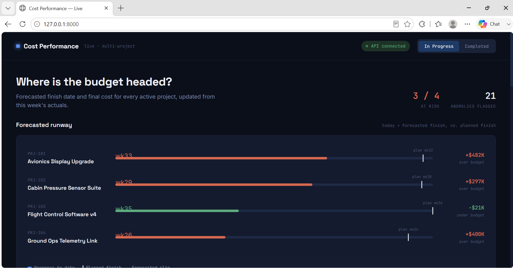
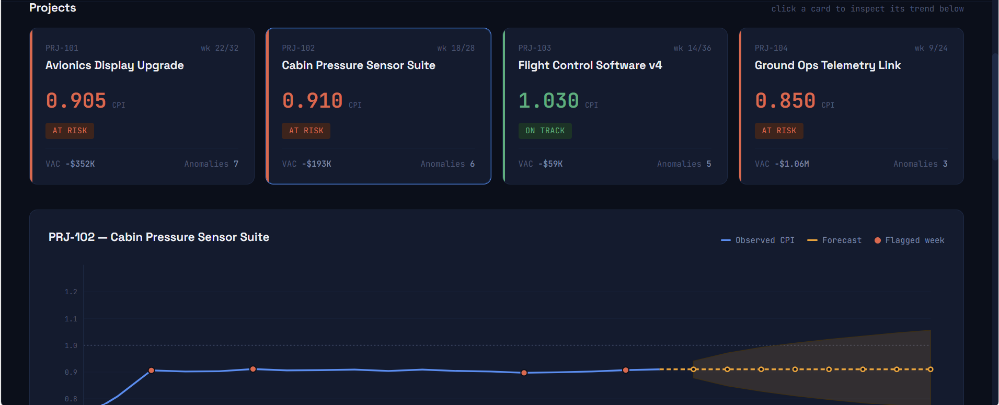
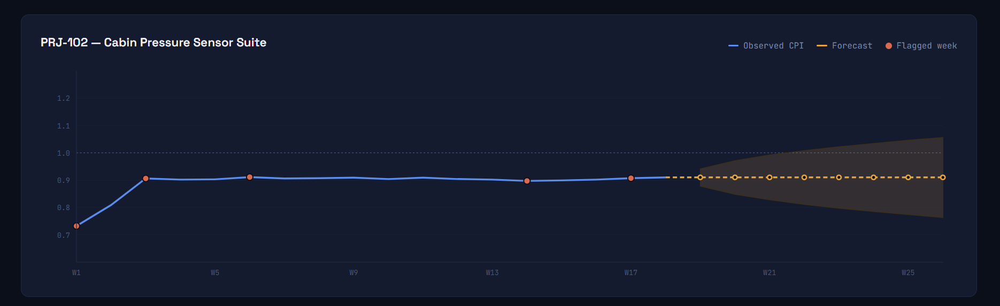
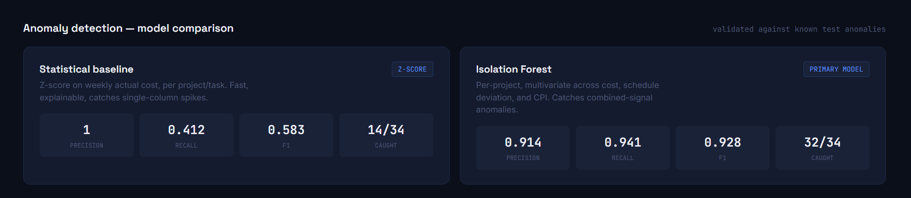
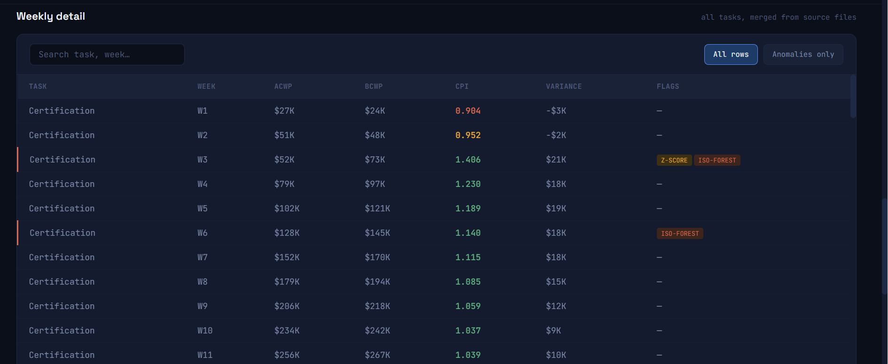
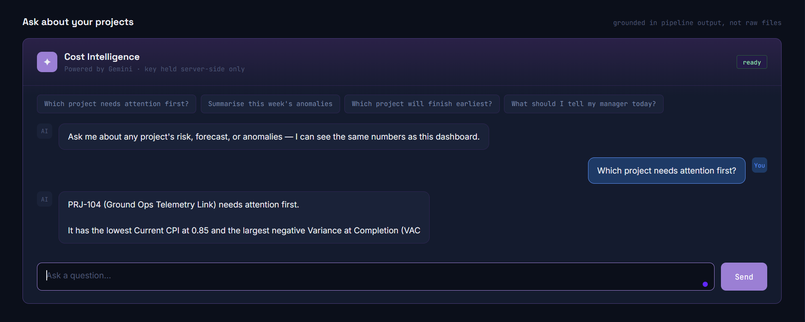
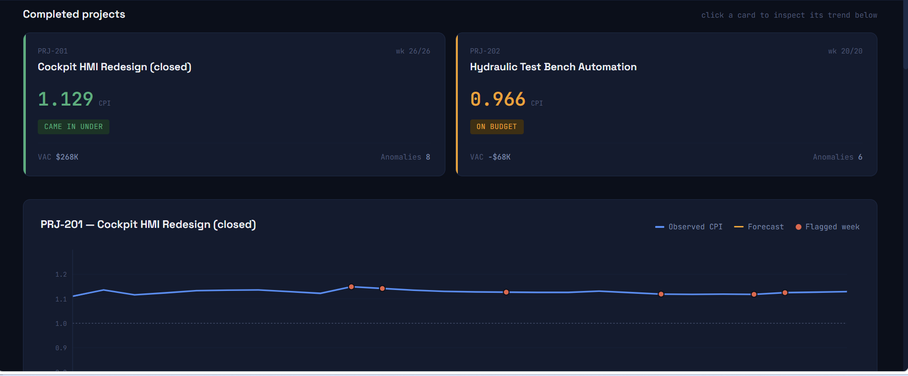

# Project Cost Performance Analyzer

A live, full-stack system for Earned Value Management (EVM) cost
tracking: a FastAPI backend reads cost data from Excel files into
SQLite, runs anomaly detection and forecasting, and serves both a REST
API and an interactive dashboard — with a server-side Gemini integration
for natural-language questions about the results.

---

## 1. The problem this solves

Project cost performance tracking is normally done by hand: pulling ETC
(Estimate to Complete) and ACWP (Actual Cost of Work Performed) figures
from multiple weekly exports and reconciling them manually. That process
is slow, error-prone, hard to scale across many projects, and depends on
individual judgment rather than consistent logic.

This system automates the full chain: consolidating cost data from
multiple source files, calculating Cost Variance and CPI, detecting
anomalous cost behavior, forecasting where each project is headed, and
surfacing all of it through a live dashboard and a natural-language
assistant — grounded in the same numbers shown on screen, not generated
from general knowledge.

A deliberate design decision sits underneath all of it: **the value of
cost performance forecasting is acting before a project finishes, not
after.** Every project here has a status of `in_progress` or
`completed`. In-progress projects get a forward-looking forecast —
projected finish week, projected final cost, risk flag. Completed
projects get a retrospective view instead, useful for comparing what
was predicted against what actually happened, with no forecast section,
because there's nothing left to predict.

---

## 2. Screenshots

### Forecasted runway — where every in-progress project is headed

Progress to date, planned finish, and forecasted slip, for every active
project, with the dollar overrun or underrun labeled directly.



### Project cards and CPI trend

Clicking a project card updates the trend chart below it — historical
CPI, an ARIMA forecast with a confidence band, and the specific weeks
flagged anomalous.





### Anomaly detection — model comparison

Two detection methods run side by side and are validated against a set
of known test anomalies, rather than presenting one model's output with
no way to judge whether it's trustworthy.



### Weekly detail

Every project, every task, every week — merged automatically from
multiple source files, searchable and filterable to anomalies only.



### AI Assistant

A natural-language question, answered using the same numbers visible on
the dashboard — not a separate, ungrounded model call.



### Completed projects — retrospective view

A different question for projects that have already finished: how did
this actually turn out, not what's forecasted. No runway section, no
risk flags — just final CPI and how it compared to budget.



---

## 3. Architecture

```
data/*.xlsx  (1 budget baseline + 7 weekly actuals files)
        │
        ▼
backend/pipeline/seed_data.py          ← generates the synthetic source files
backend/pipeline/consolidation.py      ← reads Excel, computes EVM metrics, writes to SQLite
backend/pipeline/anomaly_detection.py  ← Z-score baseline + Isolation Forest (per project), writes to SQLite
backend/pipeline/forecasting.py        ← ARIMA(1,1,1) per in-progress project, writes to SQLite
        │
        ▼
backend/cost_analyzer.db   (SQLite — projects, weekly_metrics, forecasts, validation_metrics)
        │
        ▼
backend/app.py   (FastAPI)
  ├─ GET  /api/projects                    → all projects + latest metrics + forecast summary
  ├─ GET  /api/projects/{id}/trend         → historical CPI + forecast for the trend chart
  ├─ GET  /api/weekly-detail               → full weekly table, filterable
  ├─ GET  /api/validation-metrics          → Z-score vs Isolation Forest, validated scores
  ├─ POST /api/chat                        → Gemini, using a server-side key (.env), never exposed to the browser
  ├─ GET  /api/health                      → DB status + whether Gemini is configured
  └─ GET  /                                → serves frontend/index.html
        │
        ▼
frontend/index.html   (fetches from the API above — no embedded data, no API key field)
```

One process (`python app.py`) starts everything — the API and the
dashboard are served by the same FastAPI app, on the same port. The
dashboard is genuinely live: change a source Excel file, re-run the four
pipeline scripts, refresh the browser — the new numbers are there, with
no manual re-embedding step, because every section fetches from the
database fresh on each request.

---

## 4. Setup and how to run

### 4.1 Install dependencies

```bash
cd backend
pip install -r requirements.txt
```

### 4.2 Generate the synthetic source data and build the database

```bash
cd pipeline
python seed_data.py            # creates the Excel files in backend/data/
python consolidation.py        # reads Excel, computes EVM metrics, writes to SQLite
python anomaly_detection.py    # runs both anomaly models, writes flags + validation metrics
python forecasting.py          # runs ARIMA forecasts for in-progress projects
```

Run these four in order — each depends on the previous step's output
already being in the database.

### 4.3 (Optional) Connect Gemini for the AI Assistant

```bash
cd backend
cp .env.example .env
```

Edit `.env` and add a key from **https://aistudio.google.com/app/apikey**:

```
GEMINI_API_KEY=your-actual-key-here
```

Everything else works without this step — only the chat panel needs it,
and it clearly shows "not configured" rather than failing silently if
the key is missing.

### 4.4 Start the server

```bash
cd backend
python app.py
```

Open **http://127.0.0.1:8000**.

---

## 5. What's in each layer

### 5.1 Data consolidation — `pipeline/consolidation.py`

Reads the budget baseline and all weekly actuals files (matched by a
glob pattern, not hardcoded filenames), merges them, and computes
standard EVM metrics: BCWS, BCWP (approximated from the planned
schedule, since the source data has no separate %-complete field — a
standard, named EVM simplification), ACWP, Cost Variance, CPI, EAC, and
VAC.

### 5.2 Anomaly detection — `pipeline/anomaly_detection.py`

Two methods, run side by side and validated against a planted
ground-truth log:

- **Z-score baseline** — per (project, task) group, flags weeks where
  weekly actual cost is more than 2.5 standard deviations from that
  group's own mean. Simple, fast, fully explainable.
- **Isolation Forest** (primary model) — multivariate, unsupervised,
  fit per project rather than pooled across all projects together,
  since projects here have very different elapsed durations and a
  pooled model dilutes what "normal" looks like for any one of them.

**Validated result on this dataset** (matches the numbers in the
screenshot above):

| Model | Precision | Recall | F1 |
|---|---|---|---|
| Z-score baseline | 1.000 | 0.412 | 0.583 |
| Isolation Forest | 0.914 | 0.941 | **0.928** |

### 5.3 Forecasting — `pipeline/forecasting.py`

ARIMA(1,1,1) on each in-progress project's weekly CPI series (falling
back to a linear trend on short series where ARIMA can't fit
meaningfully), extended with two outputs more directly useful than CPI
alone: a forecasted **finish week** and a forecasted **final cost**,
both scaled by the forecasted CPI trend — a project running at CPI 0.85
will take longer and cost more than planned, proportionally, not just
"trend downward" in the abstract.

Only `in_progress` projects get this. Completed projects return
`forecast: null` everywhere in the API.

### 5.4 Backend API — `backend/app.py`

FastAPI over Flask, specifically for built-in async support (Gemini
calls are I/O-bound — a slow response shouldn't block other requests),
automatic request validation via Pydantic, and free interactive API
docs at `/docs`.

### 5.5 AI Assistant (Gemini) — `/api/chat`

The frontend has no API key field anywhere. A question typed into the
chat panel goes to `POST /api/chat` on the backend; the backend builds
its context from the database — project summaries, current CPI,
anomaly counts, forecasts, model validation scores — and calls Gemini
using `GEMINI_API_KEY` from a server-side `.env` file. The key never
reaches the browser. Opening dev tools on the dashboard reveals no
credential, because there isn't one to find client-side — that's the
actual meaning of "store it in the backend": there has to be a backend
for a secret to be hidden behind.

---

## 6. Two real bugs, found and fixed during development

Both were genuinely caught through testing — an implausible number that
didn't pass a sanity check, traced back to its root cause — not found by
re-reading the code looking for problems. Worth being able to explain
plainly, since this is better evidence of working carefully than
claiming the first version was correct.

### Bug 1 — an `object` dtype silently breaking a numeric feature

`expected_etc.replace(0, pd.NA)` upcasts a `float64` pandas Series to
`dtype=object` the moment `pd.NA` is introduced. That made the
`etc_deviation` feature column object-typed instead of numeric — the
kind of bug that throws no error, it just quietly produces unreliable
behavior in anything downstream that assumes numeric dtype, including
`IsolationForest`.

**Fix:** `np.nan` instead of `pd.NA` throughout, which stays in
`float64`, plus an explicit `.astype(float)` as a defensive guarantee.

### Bug 2 — a feature calculation that broke when the data model changed

`etc_deviation` measures how far a project's remaining-cost estimate has
drifted from what you'd expect under steady linear spending. That
calculation needs the project's planned total duration. The original
code used `group["week"].max()` — the latest week present in the data —
as a stand-in for that.

That was a correct assumption in an earlier version of this project,
where every project had complete data for its full planned duration. It
became wrong the moment in-progress projects were introduced: a project
9 weeks into a 24-week plan only has data up to week 9, so
`group["week"].max()` returns 9 — and the calculation then assumed the
project was *finishing* at week 9, forcing "expected remaining cost"
toward zero right at the most recent, most operationally relevant week.
That silently suppressed the anomaly signal exactly where it mattered
most. This wasn't a flaw carried over from the earlier version — it was
an assumption that held in that version's data shape and stopped holding
the moment the requirements changed to include in-progress projects, and
it should have been re-derived at that point rather than left as-is.

**How it was caught:** a forecasted final cost for one project came out
roughly 68% over budget, which was implausible enough to investigate
rather than accept. Tracing it back showed the forecast had inherited an
ETC reading from a week that should have been flagged anomalous but
wasn't — which led to checking why detection missed it, which led to
this root cause.

**Fix:** pass each project's actual `planned_total_weeks` (from the
`projects` table) into the calculation, instead of inferring it from
however much data happens to exist so far.

**Effect:** Isolation Forest's F1 score on the validated test set went
from 0.725 (already improved by switching to per-project fitting alone)
to **0.928** — both precision and recall improved, and the specific
anomalous weeks that motivated the investigation were correctly flagged
afterward.

---

## 7. Why FastAPI + SQLite

**FastAPI over Flask** — built-in async support, automatic request
validation via Pydantic, and free interactive documentation at `/docs`.

**SQLite over a heavier database** — a real relational database, not a
toy, requiring zero setup (no separate server process, just a file),
and a legitimate choice for a read-heavy, single-writer workload like
this one. A multi-user production deployment with concurrent writes
would move to PostgreSQL — a genuine scaling decision to make later, not
a gap in this version.

---

## 8. Why these models — not transformers, RAG, agentic AI, or MCP

The underlying cost data is small, structured, and tabular — exactly the
regime where classical methods (Isolation Forest, ARIMA) are the right
tool: interpretable, fast to retrain, not data-hungry the way a
transformer would be. The Gemini layer is deliberately narrow — it never
does detection or forecasting, only narrates already-computed results,
which is what LLMs are actually good at, and keeps the pipeline's output
trustworthy regardless of how the LLM phrases its answer.

---

## 9. Project structure

```
cost_analyzer_v2/
├── README.md
├── screenshots/
├── backend/
│   ├── app.py                     ← FastAPI app: REST API + serves the frontend
│   ├── database.py                ← SQLite schema + connection handling
│   ├── requirements.txt
│   ├── .env.example                ← copy to .env and add your own Gemini key
│   ├── data/                       ← synthetic source Excel files + ground-truth log
│   └── pipeline/
│       ├── seed_data.py            ← generates synthetic source files
│       ├── consolidation.py        ← multi-file merge + EVM metric calculation
│       ├── anomaly_detection.py    ← Z-score baseline + Isolation Forest (per project)
│       └── forecasting.py          ← ARIMA + finish-week/final-cost forecast
└── frontend/
    └── index.html                  ← dashboard: fetches from the API, no embedded data, no API key field
```

---

## 10. Honest production gaps

- **Concurrency** — SQLite handles concurrent reads well but serializes
  writes; fine for this single-pipeline-writer pattern, would need
  PostgreSQL for multiple simultaneous write sources.
- **Schema validation** — consolidation assumes consistent column names
  across source files; production would validate incoming files against
  an expected schema first, with clear error reporting on mismatch.
- **%-complete approximation** — BCWP is approximated from the planned
  schedule, since the source data (per the original problem statement)
  only provides ETC and ACWP. An actual %-complete field would make this
  exact rather than approximated.
- **Auth** — the API has no authentication; fine for a local demo, not
  for a real multi-user deployment.
- **Gemini rate limits and cost** — the free tier covers light,
  occasional use comfortably; a production deployment serving many
  concurrent users would need to account for rate limits and per-token
  cost at scale.
